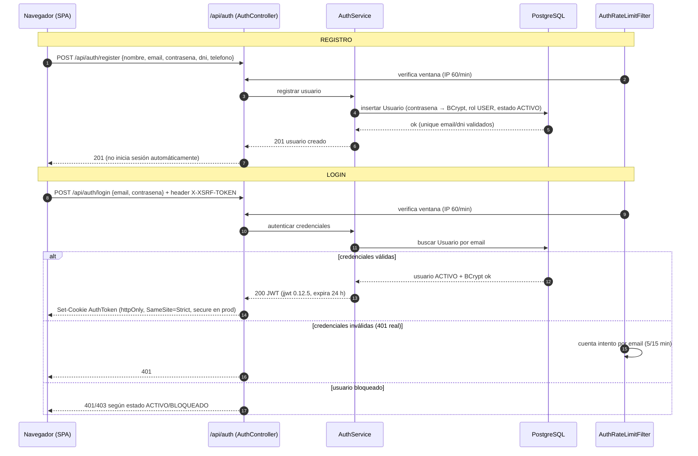
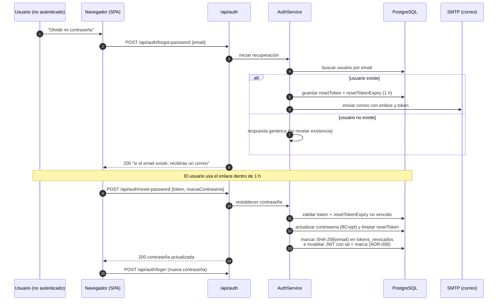

# Flujos de negocio de LibroMágico

Este documento describe los flujos de negocio principales del sistema, con los actores/roles que participan y los pasos reales que ejecutan los servicios. Complementa el [modelo de datos](data-model.md) y las decisiones de [seguridad](c4.md#nivel-3--componentes-interior-del-contenedor-spring-boot).

Actores y sus roles:

| Actor | Rol | Capacidades relevantes |
|---|---|---|
| **Lector** | `USER` | Catálogo, préstamos, devoluciones, ver y pagar sus propias multas. |
| **Bibliotecario** | `LIBRARIAN` | Gestión de libros, listado de préstamos, marcar libro perdido. |
| **Administrador** | `ADMIN` | Roles/estados de usuario, pago de multas de cualquiera, dashboard, actuator. |

Notas transversales de seguridad (ver [ADR-002](adr/ADR-002-jwt-cookie-httpOnly.md) y [ADR-003](adr/ADR-003-csrf-cookie.md)): la sesión viaja en la cookie JWT `httpOnly` `SameSite=Strict`; toda petición que cambia estado envía el header `X-XSRF-TOKEN`. El catálogo (`/api/catalogo/**`) y el health check son públicos.

---

## 1. Registro y login

El usuario se registra y luego inicia sesión; el login deposita la cookie JWT (24 h) que autentica el resto de la sesión.



Nota: el envío del header `X-XSRF-TOKEN` está implícito en la SPA para toda operación de escritura; la cookie CSRF `XSRF-TOKEN` (httpOnly=false) se lee para poblarlo.

---

## 2. Préstamo de un libro

Un usuario autenticado solicita un préstamo; el servicio valida disponibilidad y no duplicación, decrementa copias y, si es la última, marca el libro `PRESTADO`.

```mermaid
flowchart TD
    Start([Lector autenticado]) --> Post[POST /api/prestamos<br/>{libroIsbn} + X-XSRF-TOKEN]
    Post --> V1{¿libro existe?}
    V1 -- no --> 404[404 libro no encontrado]
    V1 -- sí --> V2{¿estado DISPONIBLE?}
    V2 -- no --> 409[409 no disponible]
    V2 -- sí --> V3{¿copiasDisponibles > 0?}
    V3 -- no --> 409[409 sin copias]
    V3 -- sí --> V4{¿existe préstamo ACTIVO/ATRASADO<br/>del mismo usuario + libro?}
    V4 -- sí --> 409[409 préstamo duplicado]
    V4 -- no --> Create[Crear Prestamo<br/>fechaDevolucion = fechaPrestamo + 15 días<br/>estado = ACTIVO]
    Create --> Dec[Decrementar copiasDisponibles -1]
    Dec --> Last{¿copias == 0?}
    Last -- sí --> Mark[Libro → estado PRESTADO]
    Last -- no --> Ok[Libro sigue DISPONIBLE]
    Mark --> Resp[201 préstamo creado]
    Ok --> Resp
    Resp --> Done([Fin])

    %% Roles
    Auth{Regla de URL: USER/LIBRARIAN/ADMIN}
    Post --> Auth
```

Roles: `POST /api/prestamos` permite `USER`, `LIBRARIAN` y `ADMIN`; la listación (`GET /api/prestamos`) queda restringida a `LIBRARIAN/ADMIN` (el lector ve sus préstamos vía `/api/prestamos/usuarios/{id}`).

---

## 3. Devolución de un préstamo

Al devolver, el préstamo pasa a `DEVUELTO`, se registra la fecha real, se recupera la copia y, si la devolución es tardía, se genera la multa plana de $10 y un correo.

```mermaid
flowchart TD
    Start([Usuario dueño o bibliotecario]) --> Post[POST /api/prestamos/{id}/devolucion<br/>+ X-XSRF-TOKEN]
    Post --> V1{¿préstamo existe y está ACTIVO/ATRASADO?}
    V1 -- no --> 404[404 préstamo no encontrado o ya devuelto]
    V1 -- sí --> Dev[Marcar DEVUELTO<br/>fechaEntregaReal = hoy]
    Dev --> Inc[Incrementar copiasDisponibles +1<br/>si el libro no está PERDIDO]
    Inc --> LibSt{¿libro estaba PRESTADO?}
    LibSt -- sí --> Disp[Libro → DISPONIBLE]
    LibSt -- no --> Cont1[Sigue su estado]
    Disp --> Late{¿fechaEntregaReal > fechaDevolucion?}
    Cont1 --> Late
    Late -- no, a tiempo --> Ok[200 sin multa]
    Late -- sí, tardía --> Multa[Crear Multa PENDIENTE<br/>monto = prestamo.multa.monto = $10<br/>estado = PENDIENTE]
    Multa --> Email[Enviar email de notificación<br/>de forma asíncrona]
    Email --> Resp[200 préstamo devuelto + multa generada]
    Ok --> Fin([Fin])
    Resp --> Fin

    Owner{Regla: dueño del préstamo (USER)<br/>o LIBRARIAN/ADMIN}
    Post --> Owner
```

La multa se genera **solo** en la devolución tardía y con importe plano (ver [ADR-011](adr/ADR-011-multa-plana.md)); un préstamo atrasado que aún no se devuelve no acumula deuda.

---

## 4. Vencimiento programado (marcado ATRASADO)

El scheduler revisa periódicamente los préstamos vencidos y los marca como atrasados; no genera multa por sí mismo.

```mermaid
flowchart TD
    Start([@Scheduled horario]) --> Query[Buscar préstamos ACTIVO<br/>con fechaDevolucion < hoy]
    Query --> More{¿hay más?}
    More -- sí --> Mark[Estado ACTIVO → ATRASADO<br/>sin multa progresiva]
    Mark --> Query
    More -- no --> End([Fin: multa solo se genera<br/>al devolver tarde, ver flujo 3])
    End --> Done([Fin])
```

---

## 5. Pago de una multa

El pago tiene dos vías: el lector dueño de la multa (self-service) y el administrador (pago de cualquiera).

```mermaid
flowchart TD
    A{¿Quién inicia el pago?}
    A -- "Lector (USER)" --> B[PUT /api/multas/{id}/pagar<br/>+ X-XSRF-TOKEN]
    B --> Own{¿es el dueño de la multa?}
    Own -- no --> F[403 no autorizado]
    Own -- sí --> C{¿existe y está PENDIENTE?}
    A -- "Administrador (ADMIN)" --> D[PUT /api/admin/multas/{id}/pagar<br/>+ X-XSRF-TOKEN]
    D --> C
    C -- no --> G[404 o 409 según el caso]
    C -- sí --> P[Multa PENDIENTE → PAGADO]
    P --> Resp[200 multa pagada]
    Resp --> Done([Fin])

    Listar[[Lector: GET /api/multas/mis-multas<br/>Admin: GET /api/admin/multas]]
    Resp --> Listar
```

Reglas de URL: `/api/multas/**` exige autenticación (ownership por servicio para self-service); `/api/admin/multas` y su pago son `ADMIN`.

---

## 6. Recuperación de contraseña

El usuario pide restablecer su contraseña; se genera un token con caducidad de 1 hora, se envía por correo y, al usarlo, se revoca la contraseña anterior y se invalidan las sesiones previas.



Notas: `forgot-password` está cubierto por el rate limit (IP 60/min, [ADR-007](adr/ADR-007-rate-limit-auth.md)); el cambio de contraseña revoca todas las sesiones previas del usuario mediante la denylist ([ADR-006](adr/ADR-006-jwt-revocation-denylist.md)).

---

## 7. Libro PERDIDO

Un bibliotecario o administrador marca un libro como perdido: pasa a `PERDIDO`, sus copias quedan en 0 y la operación es idempotente.

```mermaid
flowchart TD
    Start([Bibliotecario LIBRARIAN o Admin ADMIN]) --> Put[PUT /api/admin/libros/{isbn}/perdido<br/>+ X-XSRF-TOKEN]
    Put --> V1{¿libro existe?}
    V1 -- no --> 404[404 libro no encontrado]
    V1 -- sí --> V2{¿ya está PERDIDO?}
    V2 -- sí --> 409[409 idempotencia: ya perdido]
    V2 -- no --> Set[Libro → estado PERDIDO<br/>copiasDisponibles = 0]
    Set --> Resp[200 libro marcado como perdido]
    Resp --> Done([Fin])

    Rol{Regla de URL: LIBRARIAN/ADMIN}
    Put --> Rol
```

Consecuencia: un libro `PERDIDO` con copias 0 no puede prestarse (ver flujo 2) y, al devolver préstamos asociados, la copia **no** se recupera (flujo 3). El borrado de libros con préstamos activos responde `409` para proteger el historial.