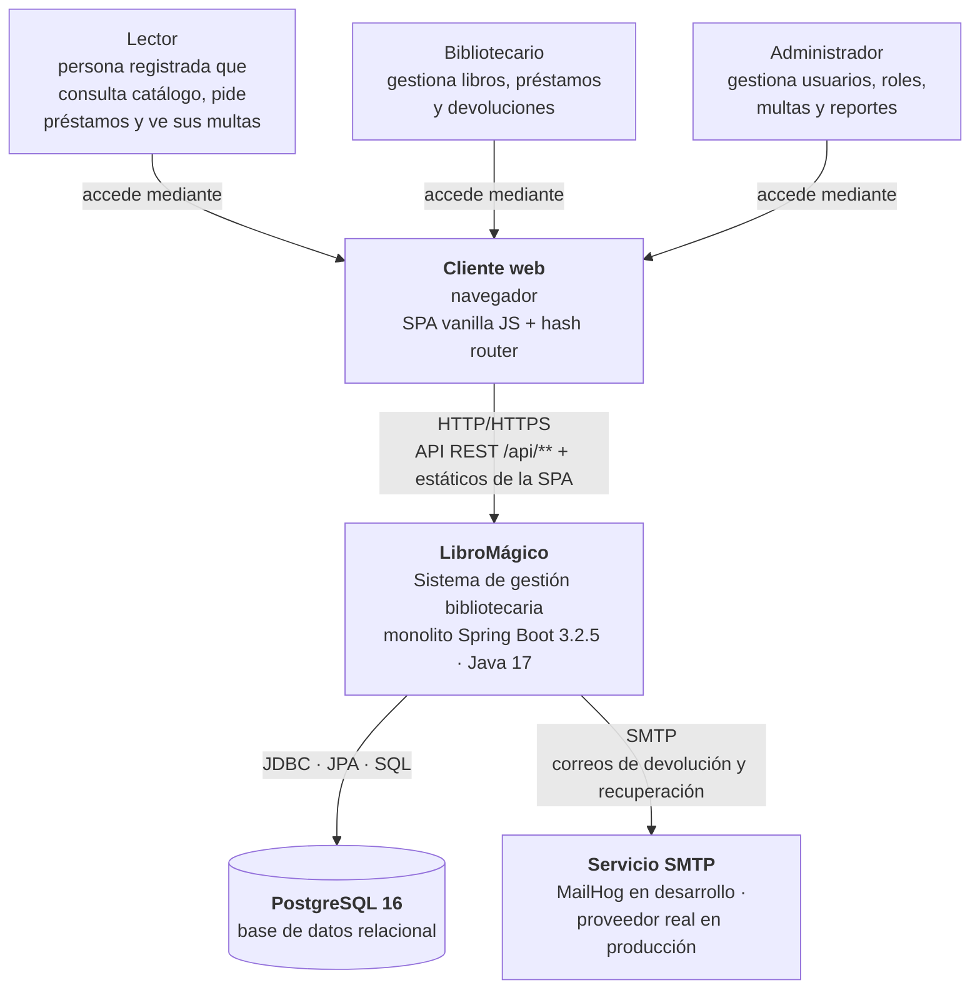
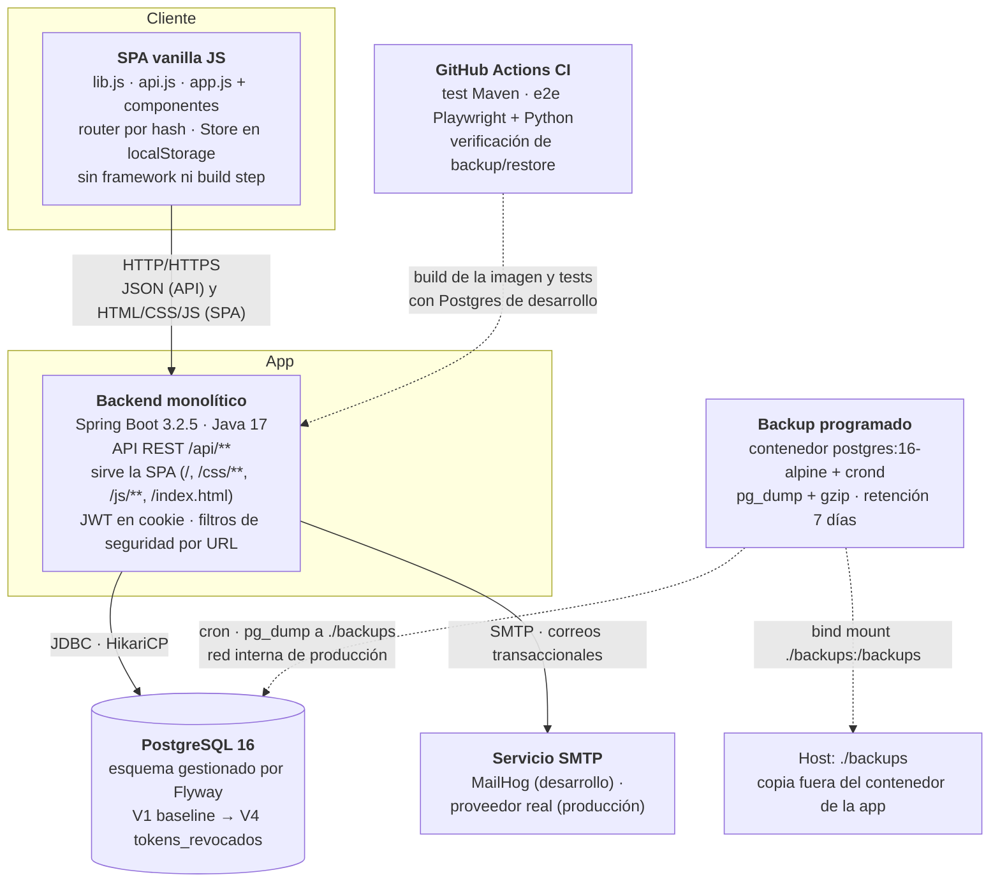

# Arquitectura de LibroMágico — Modelo C4

Este documento describe la arquitectura de _LibroMágico_, un sistema de gestión bibliotecaria, siguiendo el modelo C4 (niveles de **Contexto**, **Contenedores**, **Componentes** y **Código**). El objetivo es que cualquier persona — desarrolladora, operadora o recién incorporada al proyecto — pueda ubicar qué piezas forman el sistema y cómo se relacionan antes de leer el código fuente.

En una frase: LibroMágico es un **monolito Spring Boot 3.2.5 (Java 17)** que sirve a la vez la **API REST** (`/api/**`) y la **SPA** (JavaScript vanilla) desde un único artefacto desplegable, con **PostgreSQL 16** como base de datos y correo transaccional vía SMTP.

Documentos relacionados:

- Catálogo y convención de decisiones (ADRs): [adr/README.md](adr/README.md)
- Modelo de datos relacional y migraciones: [data-model.md](data-model.md)
- Flujos de negocio con actores y roles: [business-flows.md](business-flows.md)

---

## Nivel 1 — Contexto del sistema

El sistema interactúa con tres tipos de personas y con dos sistemas externos (base de datos y proveedor de correo). Un navegador web es el medio por el que las personas acceden a la SPA.

### Elementos del contexto

| Elemento | Rol | Detalle |
|---|---|---|
| **Lector** | Actor humano (rol `USER`) | Consulta catálogo, solicita devoluciones y préstamos, paga sus propias multas. |
| **Bibliotecario** | Actor humano (rol `LIBRARIAN`) | Gestiona libros y préstamos; puede marcar un libro como perdido. |
| **Administrador** | Actor humano (rol `ADMIN`) | Gestiona usuarios, roles y estados; paga multas de cualquier usuario y accede al dashboard. |
| **Cliente web (browser + SPA)** | Medio de acceso | SPA de JavaScript vanilla con router por hash, sin framework ni paso de build, servida por el propio sistema. |
| **LibroMágico** | Sistema (monolito) | Contiene toda la lógica de negocio y la presentación web; una sola pieza a desplegar. |
| **PostgreSQL 16** | Sistema externo | Persistencia relacional; esquema gestionado por Flyway. |
| **Servicio SMTP** | Sistema externo | Envío de correos transaccionales (devoluciones tardías, recuperación de contraseña). |

---

## Nivel 2 — Contenedores

El sistema se ejecuta como un único contenedor de aplicación que habla con la base de datos. Los contenedores de soporte (correo, backup, CI) no forman parte del camino feliz de una petición, pero son esenciales para la operación.

### Elementos de contenedores

| Contenedor | Tecnología | Responsabilidad |
|---|---|---|
| **SPA vanilla JS** | JavaScript, sin framework, sin build | Interfaz de usuario: catálogo, gestiones, préstamos, multas. Mantiene sesión vía cookie (JWT) y token CSRF. |
| **Backend monolítico** | Spring Boot 3.2.5, Java 17, Maven | Reglas de negocio, seguridad por URL, autenticación JWT, rate limiting, y servir la SPA desde el mismo contexto de aplicación. |
| **PostgreSQL 16** | PostgreSQL 16 (prod y compose); H2 en memoria solo en perfil `default`/test | Persistencia; esquema versionado con Flyway. |
| **Servicio SMTP** | MailHog (dev) / proveedor externo (prod) | Correos transaccionales (devolución tardía, recuperación de contraseña). |
| **Backup programado** | `postgres:16-alpine` + `crond` + scripts | Copia diaria `pg_dump` verificada y con retención; vive fuera del contenedor de la app. |
| **GitHub Actions CI** | Python + Playwright, Maven, Docker Compose | Verifica calidad: cobertura (JaCoCo ≥ 70%), E2E y ciclo de backup/restore. |

---

## Nivel 3 — Componentes (interior del contenedor Spring Boot)

La aplicación está organizada por el paquete raíz `com.libromagico`, con capas horizontales: `controller` → `service` → `repository` → `model`. La seguridad se resuelve mediante una cadena de filtros configurada por URL en `config`/`security`.

```mermaid
flowchart TB
    subgraph Backend["Contenedor: Backend monolítico (com.libromagico)"]
        Web["Contexto HTTP<br/>/api/** (API REST)<br/>/, /index.html, /css/**, /js/** (SPA)"]

        subgraph Filtros["Capa security — cadena de filtros (SecurityFilterChain)"]
            CSRF["CSRFFilter<br/>CookieCsrfTokenRepository<br/>(cookie XSRF-TOKEN + header X-XSRF-TOKEN)"]
            JWT["JwtAuthenticationFilter<br/>valida JWT de la cookie AuthToken<br/>consulta la denylist (jti)"]
            RATE["AuthRateLimitFilter<br/>sliding window en memoria<br/>solo rutas de autenticación"]
            SFL["Swagger chain @Order(1)<br/>CSP laxa + autenticada"]
        end

        subgraph Controllers["Capa controller"]
            C1["AuthController · CatalogController · LibroController"]
            C2["PrestamoController · MultaController · UsuarioController"]
            C3["AdminController · DashboardController · HealthController"]
        end

        subgraph Services["Capa service"]
            S1["PrestamoService / DevolucionService<br/>vencimientos · copias · multas $10"]
            S2["MultaService · TokenRevocationService<br/>denylist y marcador por email"]
            S3["AuthService · CatalogoService<br/>BCrypt · tokens de recuperación"]
        end

        Repos["Capa repository (Spring Data JPA)<br/>UsuarioRepository · LibroRepository<br/>PrestamoRepository · MultaRepository<br/>TokenRevocadoRepository"]
        Model["Capa model / entidades<br/>Usuario · Libro · Prestamo · Multa · TokenRevocado<br/>+ enums (RolUsuario, EstadoLibro, …)<br/>+ validaciones Bean Validation"]
        Config["Capa config<br/>SecurityConfig (reglas por URL) · PrestamoConfig<br/>configuración por perfil (dev/prod) · H2 solo dev"]
        Sch["@Scheduled<br/>marcado ATRASADO horario ·<br/>purge de tokens revocados"]

        Web --> Filtros
        CSRF --> JWT
        JWT --> RATE
        RATE --> Controllers
        Controllers --> Services
        Services --> Repos
        Services --> Sch
        Services --> Model
        Repos --> Model
        Config --> Filtros
        Config --> Controllers
        Repos --> PG[(PostgreSQL 16)]
    end
```

### Componentes principales

| Componente | Cobertura | Responsabilidad |
|---|---|---|
| **`controller`** | Paquetes `*.controller` | Fachada REST: transforman HTTP en llamadas de servicio y devuelven JSON. Las reglas de autorización se aplican por URL (matchers en `SecurityConfig`). |
| **`service`** | Paquetes `*.service` | Lógica de negocio: préstamos, devoluciones, multas, autenticación, catálogo, gestión de tokens revocados. |
| **`repository`** | Interfaces Spring Data JPA | Acceso a datos, consultas derivadas y JPQL (incluye borrado bulk de tokens). |
| **`model`** | Entidades y enums JPA | Mapeo objeto-relacional y validaciones de dominio (ISBN, DNI, teléfono, año no futuro). |
| **`security` / filtros** | Cadena de filtros | Autenticación JWT (`JwtAuthenticationFilter`), rate limiting de autenticación (`AuthRateLimitFilter`), protección CSRF y cadenas específicas (Swagger). |
| **`config`** | Clases de configuración | `SecurityConfig` (reglas de URLs), `PrestamoConfig` (monto de multa), configuración según perfil activo. |
| **`@Scheduled`** | Tareas programadas | Marcado de préstamos `ATRASADO` (horario) y purga de `tokens_revocados`. |

---

## Nivel 4 — Código

El nivel 4 del modelo C4 (la descomposición por clases y módulos del código) **no se documenta aquí a propósito**. Ese detalle está cubierto por los [registros de decisiones de arquitectura (ADRs)](adr/README.md) y por el propio código fuente, que sigue una estructura de capas plana y predecible (`controller → service → repository → model`). Documentar clases concretas en este repositorio duplicaría el código y no aportaría contexto nuevo.

---

## Decisión de arquitectura clave: por qué un monolito

LibroMágico es deliberadamente un monolito por tres razones:

1. **Equipo pequeño y enfoque estrecho**: un solo equipo (o una persona) mantiene todo el producto; dividir en servicios añade coste de coordinación sin beneficio.
2. **Artefacto único**: la API y la SPA conviven en el mismo artefacto (`.jar`), por lo que hay un único despliegue, un único ciclo de versionado y una única manera de probar el sistema completo.
3. **Modelo operativo simple**: una sola instancia basta para la carga prevista; el despliegue es un contenedor Spring Boot y una base de datos, sin orquestación compleja.

Como consecuencia, la aplicación escala verticalmente (más recursos a la misma instancia) en lugar de horizontalmente, y el acoplamiento entre capas o módulos debe disciplinarse con las reglas de `SecurityConfig` y la estructura de paquetes. Si algún día la carga o el equipo crecen, los ADRs [009 (ausencia de Redis)](adr/ADR-009-sin-redis.md) y [001 (monolito Spring Boot)](adr/ADR-001-monolito-spring-boot.md) registran exactamente qué revisar antes de escalar.