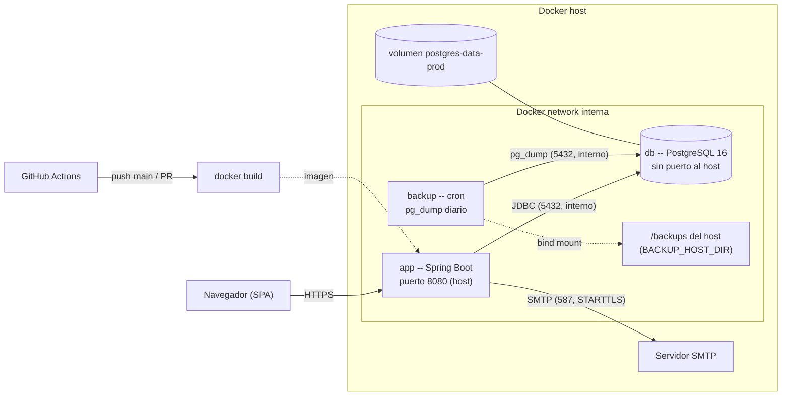

# Infraestructura — LibroMágico

Descripción de la infraestructura productiva: imagen Docker, stack Compose, red interna y
volúmenes, pipeline de CI/CD, seguridad de la infraestructura y observabilidad.

## Diagrama

## Piezas del stack

### Imagen (`Dockerfile`)

- **Multi-stage**: stage 1 con `maven:3.9-eclipse-temurin-17` compila y empaqueta
  (`mvn package -DskipTests`, pruebas no se corren en build; las corre el CI); stage 2 con
  `eclipse-temurin:17-jre-alpine` solo copia el JAR.
- **Usuario no-root** (`appuser`): el contenedor no corre como root.
- `ENV SPRING_PROFILES_ACTIVE=prod`; ticket `EXPOSE 8080`; directorio `logs/` para el
  logging rolling del runtime.

### Compose productivo (`docker-compose.prod.yml`)

| Servicio | Imagen | Puertos | Volúmenes | Healthcheck | Notas |
|----------|--------|---------|-----------|-------------|-------|
| `app` | `libromagico` (build local) | `${APP_PORT:-8080}:8080` | — | `/api/health` | Perfil `prod`; exige variables con `${VAR:?}`; `depends_on: db (healthy)`. |
| `db` | `postgres:16-alpine` | **ninguno** | `postgres-data-prod` | `pg_isready` (base `libromagico`) | Accesible solo por la red interna. |
| `backup` | `postgres:16-alpine` | **ninguno** | bind mount `${BACKUP_HOST_DIR:-./backups}:/backups` | — | `crond` ejecuta `scripts/backup.sh` con `BACKUP_SCHEDULE` (default `0 2 * * *`) y retención `BACKUP_RETENTION_DAYS` (default 7). |

**Red interna**: `db` y `backup` no exponen puertos al host. Solo `app` es accesible desde
fuera, vía el puerto del host. La base no es alcanzable desde el exterior del servidor.

**Volúmenes**:

- `postgres-data-prod`: volumen gestionado por Docker con los datos de PostgreSQL. **Persiste
  la base** entre recreaciones del stack (se recrea solo con `docker volume rm`).
- Bind mount `./backups` (host) → `/backups` (contenedor backup): los dumps diarios viven en
  el **host**, no en el contenedor. El log del cron (`backup.log`) también aterriza ahí.

## CI/CD

`GitHub Actions` (`.github/workflows/ci.yml`). Se ejecuta en **push a `main`** y en **PRs**.
Tres jobs en cadena:

| Job | Corre | Qué hace | Gating / artefactos |
|-----|-------|----------|---------------------|
| `test` | primero | JDK 17 Temurin; `mvn -B -Pcoverage verify` con JaCoCo. | **Coeficiente de cobertura ≥ 70%** — si no se cumple, el build falla. Sube reports de cobertura. |
| `e2e` | `needs: test` | `docker compose down -v && up -d --build`; espera `/api/health` (hasta 90 intentos × 5 s); Python 3.12 + `pip install -r requirements.txt` + `playwright install chromium --with-deps` + `pytest -v`. | Sube reporte E2E. Finaliza siempre con `down -v`. |
| `backup-restore` | en paralelo | Ejecuta los scripts reales contra contenedores: dump en `5433`, restore en `5434`; verifica el seed y la retención. | Valida que el ciclo backup/restore funciona de verdad. |

El CI **no sube imágenes** a registries: la imagen se construye en el host donde se despliega
(ver `docs/ops/deployment.md`).

## Seguridad de la infraestructura

- **Secretos vía variables de entorno** (`.env.prod`), nunca en el repositorio ni en la
  imagen. Las obligatorias (`DB_USER`, `DB_PASS`, `JWT_SECRET`, `CORS_ALLOWED_ORIGINS`,
  `SMTP_HOST`, `APP_BASE_URL`) se exigen con `${VAR:?}`: la app falla al arrancar si faltan.
- **Usuario no-root** dentro del contenedor `app`.
- **Base sin puerto expuesto al host**: solo se accede por la red interna de Docker.
- **CSP y cookies httpOnly**: la cookie JWT es `httpOnly` (no accesible desde JS) y en prod
  se marca `secure` (`app.cookie-secure=true`).
- **`/actuator/metrics` con rol ADMIN** en prod; `/actuator/health` es público.

## Observabilidad

| Pieza | Qué expone |
|-------|-----------|
| **Actuator** | `/actuator/health` (público, agrega salud de la DB), `/actuator/info`, `/actuator/metrics` (requiere ADMIN en prod). |
| **`/api/health`** | `{"status":"UP|DOWN","db":"UP|DOWN"}` con `SELECT 1` real (timeout 3 s). Usado por el healthcheck de Docker y por el CI. |
| **Correlation IDs** | `CorrelationIdFilter` (`@Order(0)`) genera `X-Correlation-Id` por petición y lo propaga a hilos async; cada línea de log lleva `correlationId` en el patrón `%X{correlationId:-no-id}`. Permite seguir una petición completa en los logs. |
| **`logback-spring.xml`** | Consola + rolling file `logs/libromagico.log` (10 MB por archivo, 7 días, tope 10 GB). |

## Backup / restore

El stack incluye el servicio `backup` (dump diario por cron) y scripts de restore guiados;
las métricas son RPO 24 h / RTO < 30 min. Ver el detalle completo, el procedimiento de
restore y las advertencias en **`docs/ops/backup-restore.md`**.